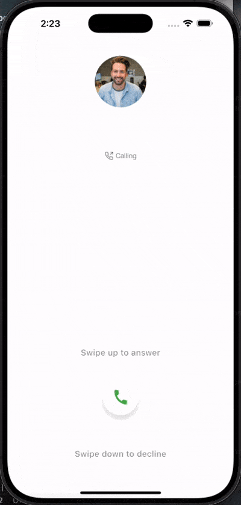

# 📞 Bouncing Call Slider

A beautiful and highly customizable Flutter widget that mimics an incoming call slider — swipe **up to answer** or **down to decline** with bouncing, animated, and haptic feedback effects.

> Perfect for call UI interfaces, action confirmation prompts, or interactive in-app communication designs.

---

## ✨ Features

- 🟢 Swipe **up to accept**, 🔴 swipe **down to decline**
- 🎯 Bouncing animation on idle for attention-grabbing effect
- 🎉 Haptic feedback and subtle rotation effect
- 💡 Custom icons, text, colors, and dimensions
- 🛠️ Fully themeable and responsive
- 📱 Supports both Android & iOS

---

## 📷 Demo



---

## 🚀 Getting Started

Add this package to your project by copying the source code or importing it into your app. If published to pub.dev:

```yaml
dependencies:
  call_slider_button: ^1.0.0
```

Then run:

```bash
dart pub get
```
## 💡 Usage

```dart
import 'package:flutter/material.dart';
import 'package:call_slider_button/bouncing_call_slider.dart';

BouncingCallSlider(
  onAccept: () => print("Accepted!"),
  onDecline: () => print("Declined!"),
  acceptText: 'Swipe up to answer',
  declineText: 'Swipe down to decline',
);
```

## ⚙️ Customization Parameters

| Parameter                | Type           | Description                        | Default                   |
| ------------------------ | -------------- | ---------------------------------- | ------------------------- |
| `onAccept`               | `VoidCallback` | Called when user slides up         | **Required**              |
| `onDecline`              | `VoidCallback` | Called when user slides down       | **Required**              |
| `acceptText`             | `String`       | Accept instruction text            | `'Swipe up to answer'`    |
| `declineText`            | `String`       | Decline instruction text           | `'Swipe down to decline'` |
| `textStyle`              | `TextStyle?`   | Text style for both labels         | `null`                    |
| `acceptTextColor`        | `Color`        | Color of accept label text         | `Colors.grey`             |
| `declineTextColor`       | `Color`        | Color of decline label text        | `Colors.grey`             |
| `iconColorAccept`        | `Color`        | Icon color on accept               | `Colors.green`            |
| `iconColorDecline`       | `Color`        | Icon color on decline              | `Colors.red`              |
| `callBtnBackgroundColor` | `Color`        | Button background color            | `Colors.white`            |
| `acceptIcon`             | `Widget?`      | Custom icon for accept             | `Icons.call`              |
| `declineIcon`            | `Widget?`      | Custom icon for decline            | `Icons.call_end`          |
| `height`                 | `double`       | Total height of the widget         | `200`                     |
| `width`                  | `double`       | Width of the call button           | `70`                      |
| `iconSize`               | `double`       | Size of the icon inside the button | `35`                      |
| `buttonSize`             | `double`       | Diameter of the call button        | `70`                      |


## 📂 Example App
You can find a full example inside the example/ folder.

To run it:

```dart
cd example
flutter run
```

## 📄 License
This project is licensed under the MIT License — see the [LICENSE](LICENSE) file for details.

## ❤️ Contributing

1. Fork the repo
2. Create a new branch: `git checkout -b feature/YourFeature`
3. Commit your changes: \`git commit -m 'Add YourFeature'
4. Push to the branch: `git push origin feature/YourFeature`
5. Open a Pull Request